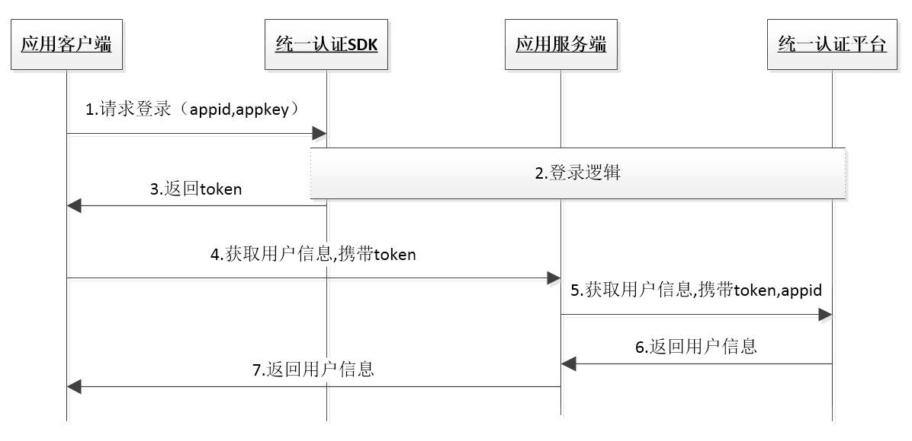

# 1. 开发环境配置 

sdk技术问题沟通QQ群：609994083</br>

**注：SDK在获取token过程中，用户手机必须在打开数据网络情况下才能获取成功，纯wifi环境下会自动跳转到SDK的短信验证码页面或短信上行取号（如果有配置）或者返回错误码**</br>

## 1.1. 环境配置及发布

1. 导入统一认证framework，直接将统一认证`TYRZSDK.framework`拖到项目中
2. 在Xcode中找到`TARGETS-->Build Setting-->Linking-->Other Linker Flags`在这选项中需要添加`-ObjC`
3. TARGETS-->Build Setting-->搜索框中搜索"BitCode"选项,并且将该选项的属性设置为NO
4. 添加bundle资源包 TARGETS -->Build Phases -->Copy Bundle Resources --> 点击 "+" --> Add Other --> TYRZSDK.frameWork --> Resource.bundle -->Open 即可

</br>

## 1.2. Hello 统一认证 

本节内容主要面向新接入统一认证的开发者，介绍快速集成统一认证的基本服务的方法。

### 1.2.1. 统一认证登录流程



由流程图可知，业务客户端集成SDK后只需要完成2步集成实现登录

    1.	调用登录接口获取token
    2.	携带token请求登录

</br>

### 1.2.2. 统一认证登录集成步骤

**第一步：**

在`appDelegate.m`中的`didFinish`函数中添加初始化代码。初始化代码只需要执行一次就可以。

```objective-c
- (BOOL)application:(UIApplication *)application didFinishLaunchingWithOptions:(NSDictionary *)launchOptions {
    // Override point for customization after application launch.
     [TYRZUILogin initializeWithAppId:APPID appKey:APPKEY];
    return YES;
}
```

**第二步：**

在需要用到登录的地方调用登录接口即可，以下是预取号登录示例

```objective-c
/**
 预取号登录
 */
- (void)showImplicitLogin {
    [TYRZUILogin preGetPhonenumber:^(id sender) {
        NSNumber *result = sender[@"resultCode"];
        if (result.boolValue) {
            NSLog(@"预取号成功");
            [TYRZUILogin loginExplicitly:self complete:^(id sender) {
                NSLog(@"显式登录:%@",sender);
                NSString *resultCode = sender[@"resultCode"];
                self.token = sender[@"token"];
                NSMutableDictionary *result = [NSMutableDictionary dictionaryWithDictionary:sender];
                if ([resultCode isEqualToString:SUCCESSCODE
                     ]) {
                    result[@"result"] = @"获取token成功";
                } else {
                    result[@"result"] = @"获取token失败";
                }
                [self showInfo:result];
            }];
        } else {
            NSLog(@"预取号失败");
        }
    }];
}

```

<div STYLE="page-break-after: always;"></div>

#2. SDK方法说明

## 2.1. 初始化appid和appkey

### 2.1.1. 方法描述

**功能**

用于初始化appid、appkey设置。

**原型**

`TYRZBaseApi -- initializeWithAppId:appKey:`

```objective-c
+ (void)initializeWithAppId:(NSString *)appId appKey:(NSString *)appKey;
```

</br>

### 2.1.2. 参数说明

**请求参数**


| 参数     | 类型       | 说明       | 是否必填 |
| ------ | -------- | -------- | ---- |
| appID  | NSString | 应用的appid | 是    |
| appKey | NSString | 应用密钥     | 是    |


**响应参数**

无

</br>

### 2.1.3. 示例

**请求示例代码**

```objective-c
[TYRZUILogin initializeWithAppId:APPID appKey:APPKEY];
```


**响应示例代码**

无

</br>

## 2.2. 预取号


### 2.2.1. 方法描述

**功能**

使用SDK登录前，可以通过预取号方法提前获取用户信息并缓存。用户使用一键登录时，会优先使用缓存的信息快速请求SDK服务端获取`token`和`用户ID(openID)`等信息，提高登录速度。缓存的有效时间是5min并且只能使用一次，预取号成功后，如果用户成功进入授权页，但未授权给应用（未点一键登录按钮），并返回到上一级页面，预取号缓存将失效，预取号缓存失效后，用户使用显式登录时，将使用常规流程获取token信息。**注：预取号方法仅对显式登录有效。**

**方法处理逻辑**


**原型**

`TYRZUILogin -- preGetPhonenumber:complete`

```objective-c
+ (void)preGetPhonenumber:(void (^)(id sender))complete 
```

</br>

### 2.2.2. 参数说明

**请求参数**

无

**响应参数**

| 参数         | 类型         | 说明       | 是否必填 |
| ---------- | ---------- | -------- | ---- |
| resultCode | NSUinteger | 返回相应的结果码 | 是    |
| desc       | NSString   | 调用描述     | 是    |

</br>

### 2.2.3. 示例

**请求示例代码**

```objective-c
- (void)showSMSCodeLogin {

    [TYRZUILogin preGetPhonenumber:^(id sender) {
        NSString *resultCode = sender[@"resultCode"];
        NSMutableDictionary *result = [NSMutableDictionary dictionaryWithDictionary:sender];
        if ([resultCode isEqualToString:CLIENTSUCCESSCODECLIENT]) {
            NSLog(@"预取号成功");
        } else {
            NSLog(@"预取号失败");
        }
        [self showInfo:result];
    }];
    
}
```

</br>

**响应示例代码**

```
{
    resultCode = 103000;
    desc = "success"
}
```

</br>

## 2.3. 显式登录

### 2.3.1. 方法描述

**功能**

显式登录即一键登录，本方法用于实现**获取用户信息**功能。使用本方法获取到的token，可通过`获取用户信息接口`交换用户信息。</br>

**交互过程**

SDK自动弹出登录缓冲界面（图一，<font  style="color:blue; font-style:italic;">预取号成功将不会弹出缓冲页</font>），同时SDK将手机号码信息缓存；若获取用户本机号码成功，自动切换到授权登录页面（图二），用户授权登录后，即可使用本机号码进行登录；若用户获取本机号码失败，自动跳转到短信验证码登录页面（图三，<font  style="color:blue; font-style:italic;">开发者可以选择是否跳到SDK提供的短信验证页面</font>），引导用户使用短信验证码登录。


</br>

**方法处理逻辑**


**原型**

`TYRZUILogin -- getTokenExpWithController:complete:`

```objective-c
+ (void)getTokenExpWithController:(UIViewController *)vc
                         complete:(void (^)(id sender))complete;
```

</br>

### 2.3.2. 参数说明

**请求参数**

| 参数       | 类型               | 说明          | 是否必填 |
| -------- | ---------------- | ----------- | ---- |
| vc       | UIViewController | 调用显式登录所在的vc | 是    |
| complete | UAFinishBlock    | 登录回调        | 是    |

</br>

**响应参数**

| 参数          | 类型       | 说明                                       | 是否必填  |
| ----------- | -------- | ---------------------------------------- | ----- |
| resultCode  | NSString | 返回相应的结果码                                 | 是     |
| token       | NSString | 成功时返回：临时凭证，token有效期2min，一次有效，同一用户（手机号）10分钟内获取token且未使用的数量不超过30个 | 成功时必填 |
| openID      | NSString | 成功时返回：用户身份唯一标识                           | 成功时必填 |
| authType    | NSString | 认证类型：0:其他；</br>1:WiFi下网关鉴权；</br>2:网关鉴权；</br>3:短信上行鉴权；</br>7:短信验证码登录 | 成功时必填 |
| authTypeDes | NSString | 认证类型描述，对应authType                        | 成功时必填 |
| desc        | NSString | 调用描述                                     | 否     |

</br>

### 2.3.3. 示例

**请求示例代码**

```objective-c
//显式登录
- (void)showExplicitlyLogin {
     __weak typeof(self) weakSelf = self;
    [TYRZUILogin getTokenExpWithController:weakSelf
                                  complete:^(id sender) {
                                        NSString *resultCode = sender[@"resultCode"];
                                        if ([resultCode isEqualToString:@"103000"]){ //返回成功执行的分支
                                           //显式登录成功返回token
                                           self.token = sender[@"token"]; 
                                        }       
                                    }];
}
```

</br>

**响应示例代码**

```
{
    authType = "1";
    authTypeDesc = "WIFI网关鉴权";
    openid = 1918310031;
    resultCode = 103000;
    token = 84840100013202003A4E45564452444D794E7A6C474E45557A4F4441314D304E4340687474703A2F2F3132302E3139372E3233352E32373A383038302F72732F403032030004030DF69E040012383030313230313730383137313031343230FF0020C8C9629B915C41DC3C9528E5D5796BB1551F2A49F8FCF7B5BA23ED0F28A8FAE9;
}
```

</br>

## 2.4. 隐式登录

### 2.4.1. 方法描述

**功能**

本方法目前只能用于实现**本机号码校验**功能。开发者通过隐式登录方法，无授权弹窗，可获取到token和openID（需在开放平台勾选相关能力），应用服务端凭token向SDK服务端请求校验是否本机号码。隐式取号失败后，不支持短信上行和短信验证码二次验证。注：隐式登录返回的token无法通过`获取用户信息接口`换取手机号码，只支持通过`本机号码校验接口`校验用户手机号码身份，否则会报错。

**方法处理逻辑**


**原型**

`TYRZUILogin -- getTokenImpWithComplete:`

```objective-c

+ (void)getTokenImpWithComplete:(void (^)(id sender))complete

```

### 2.4.2 参数说明

**请求参数**

无

</br>

**响应参数**

| 参数          | 类型       | 说明                                       | 是否必填  |
| ----------- | -------- | ---------------------------------------- | ----- |
| resultCode  | NSString | 返回相应的结果码                                 | 是     |
| token       | NSString | 成功时返回：临时凭证，token有效期2min，一次有效，同一用户（手机号）10分钟内获取token且未使用的数量不超过30个 | 成功时必填 |
| authType    | NSString | 认证类型：0:其他；</br>1:WiFi下网关鉴权；</br>2:网关鉴权；</br>3:短信上行鉴权；</br>7:短信验证码登录 | 成功时必填 |
| authTypeDes | NSString | 认证类型描述，对应authType                        | 成功时必填 |
| OpenID      | NSString | 用户身份唯一标识（参数需在开放平台勾选相关能力后开放，如果勾选了一键登录能力，使用本方法时，不返回OpenID） | 成功返回  |


## 2.5. 短信验证码页面登录开关

### 2.5.1. 方法描述

**功能**

该方法用于配置是否打开SDK自带的短信验证码服务，默认短信验证码服务是打开状态。SDK在两种情况会使用短信验证码登录：1、一键登录（网关取号）失败后，自动跳转到短验页面；2、在授权页面使用`切换账号`（见下图）后，用户可以选择使用非本机号码通过短信验证码登录账号。如果开发者需要自定义短信验证码页面，可将该方法的属性设置为YES。注：如果开发者没有把“`切换账号`”按钮隐藏，用户点击切换账号时，也可以跳转到SDK自带的短信验证码页面。


</br>

**原型**

`TYRZUILogin -- setCustomSMS`

```objective-c

+ (void)enableCustomSMS:(BOOL)flag;

```

</br>

### 2.5.2. 参数说明

**请求参数**

| 参数     | 类型   | 说明                                       | 是否必填   |
| ------ | ---- | ---------------------------------------- | ------ |
| enable | BOOL | NO时显式登录取号失败会跳转至短信验证码界面</br>YES时显式登录取号失败允许跳转到开发者自定的跳转页面，不会跳转到SDK自带的短信验证码界面</br> 默认值为NO | 是</br> |

**响应参数**

无

</br>

### 2.5.3. 示例

**请求示例代码**

```objective-c
  [TYRZUILogin enableCustomSMS:NO];
     __weak typeof(self) weakSelf = self;
    [TYRZUILogin getTokenExpWithController:weakSelf
                                  complete:^(id sender) {
                                        NSString *resultCode = sender[@"resultCode"];
                                        if ([resultCode isEqualToString:@"103000"]){ //返回成功执行的分支
                                           //显式登录成功返回token
                                           self.token = sender[@"token"]; 
                                        }       
                                    }];
```

</br>

**响应示例代码**

设置逻辑不返回

## 2.6. 开发者自定义UI

SDK**登录授权页**和**短信验证码页面**部分元素可供开发者编辑，如开发者不需自定义，则使用SDK提供的默认样式，建议开发者按照开发者自定义规则个性化授权页面和短信验证页面：


### 2.6.1. 方法说明

**功能**

通过本方法，修改授权页和短信验证码页面的元素

**原型**
`TYRZUILogin -- customUIWithParams:customViews:`

```objective-c
+ (void)customUIWithParams:(NSDictionary *)customUIParams
               customViews:(void(^)(NSDictionary *customAreaView))customViews;
```

### 2.6.2. 参数说明

**请求参数**

| 参数             | 类型                                    | 说明               | 是否必填 |
| -------------- | ------------------------------------- | ---------------- | ---- |
| customUIParams | NSDictionary                          | 用户编辑自定义UI属性      | 否    |
| customViews    | void(^)(NSDictionary *customAreaView) | 用户添加自定义视图，仅支持授权页 | 否    |

**响应参数**

无

**customUIParams参数结构**

1. 当UI元素不嵌套时（所属层级1），授权页面和短信验证码页面显示效果一致；
2. 当UI元素嵌套时（所属层级2），根据嵌套的上级元素（UAAuthPage或UASMSPage），分别定义授权页面和短信验证码页面的显示效果；
3. 部分UI元素仅支持在短信验证码或授权页面显示，这部分元素必须嵌套在相应的页面下
4. 开发者如果不设置自定义元素，将使用系统默认UI
5. 短信验证码页面不支持开发者添加子视图。

| 键名称                                   | 值类型          | 使用说明                                     | 是否可嵌套 | 所属层级            |
| ------------------------------------- | ------------ | ---------------------------------------- | ----- | :-------------- |
| UAAuthPage                            | NSDictionary | 授权页面                                     | 否     | 1               |
| UASMSPage                             | NSDictionary | 短信验证码页面                                  | 否     | 1               |
| UAPageNavLeftLogo                     | UIImage      | 设置导航栏返回图标                                | 否     | 1               |
| UAPageNavBackgroundColor              | UIColor      | 设置导航栏背景色                                 | 否     | 1               |
| UAPageNavTitle                        | NSString     | 设置导航栏标题文字内容                              | 是     | 1或者2            |
| UAPageNavRightItem                    | UIButton     | 设置导航栏右侧按钮，默认该按钮隐藏                        | 是     | 2               |
| UAPageContentLogo                     | UIImage      | 设置logo图片（建议尺寸大于80x80 ），默认为中移动logo        | 是     | 1或者2            |
| UAPageContentPhoneNumberBGColor       | UIColor      | 设置手机号码显示区域底色                             | 是     | 2               |
| UAPageContentPhoneNumberClearImage    | UIImage      | 设置手机号码输入框叉叉图标                            | 是     | 2，嵌套在UASMSPage  |
| UAPageContentSMSCodeBGColor           | UIColor      | 设置短验输入框底色                                | 是     | 2，嵌套在UASMSPage  |
| UAPageContentAccountSwitchHidden      | NSNumber     | 设置切换账号显示或隐藏，YES隐藏，NO显示                   | 是     | 2，嵌套在UAAuthPage |
| UAPageContentLoginButtonBGColor       | UIColor      | 设置登录按钮的底色                                | 是     | 2               |
| UAPageContentLoginButtonUnableBGColor | UIColor      | 设置短验页面登录按钮不可用状态时的底色                      | 是     | 2，嵌套在UASMSPage  |
| UAPageContentLoginButtonBGImage       | UIImage      | 设置登录按钮背景图（如果同时设置按钮底色，底色将覆盖背景图）           | 是     | 2               |
| UAPageContentLoginButtonUnableBGImage | UIImage      | 设置短验页面登录按钮不可用状态时的背景图（如果同时设置按钮底色，底色将覆盖背景图） | 是     | 2，嵌套在UASMSPage  |
| UAPageContentLoginButtonCornerRadius  | NSNumber     | 设置登录按钮圆角（根据按钮高度调整圆角）                     | 是     | 2               |
| UAPageContentLoginButtonTitleFont     | UIFont       | 设置登录按钮字体和大小                              | 是     | 2               |
| UAPageContentLoginButtonTitleColor    | UIColor      | 设置登录按钮字体颜色                               | 是     | 2               |
| UAPageContentLoginButtonTitle         | NSString     | 设置登录按钮文字                                 | 是     | 1或者2            |
| UAPageContentSeperatorHidden          | NSNumber     | 设置logo下面分割线是否隐藏，YES隐藏，NO显示               | 是     | 2               |


**使用示例**

``` objective-c

    UIButton *navRightButton = [UIButton buttonWithType:UIButtonTypeSystem];
    [navRightButton setTitle:@"注册" forState:UIControlStateNormal];
    [navRightButton sizeToFit];
    [navRightButton addTarget:self action:@selector(reigsterButtonAction:) forControlEvents:UIControlEventTouchUpInside];
    
    NSString *path = [NSBundle.mainBundle pathForResource:@"(Left_Arrow)_SFont.CN.png" ofType:nil];
    UIImage *leftLogo = [UIImage imageWithContentsOfFile:path];
    
    //以下字典结构如果需要自定义元素应用到每个页面，则把元素的键名写在第一层，第二层的元素键名则只显示在特定的页面
    NSDictionary *uiParams = @{
                               
                               @"UAPageNavLeftLogo":leftLogo, //自定义导航栏返回的logo
                               @"UAAuthPage":@{
                                       
                                       @"UAPageNavRightItem":navRightButton, //自定义导航栏右侧返回按钮（只显示在授权页）
                                       @"UAPageContentSeperatorHidden":@(NO), //控制logo下分割线显示或者隐藏（只隐藏授权页的分割线）
                                       
                                       },
                               
                               };
    
    [TYRZUILogin customUIWithParams:uiParams customViews:^(NSDictionary *customAreaView) {
        
//此处将自定义的视图加进对应页面的View
        if (customAreaView[@"UAAuthPage"]) { //UAAuthPage为授权页面的键名（只显示一个手机号码，无验证码输入）
            
            UIView *authView = customAreaView[@"UAAuthPage"];
            
            [self customShareButtonsWithView:authView];
        }
        
    }];

```

<div STYLE="page-break-after: always;"></div>

## 2.7. 获取SDK版本号

供接入方区分SDK的版本号，便于反馈SDK的相关信息

### 2.7.1. 方法说明

**功能**

获取SDK版本号

**原型**

``` objective-c

@property (nonatomic,class,readonly) NSString *sdkVersion;

```

**调用示例**

``` objective-c

NSString *sdkVersion = TYRZUILogin.sdkVersion;

```

# 3. 平台接口说明

## 3.1. 获取用户信息接口

业务平台或服务端携带用户授权成功后的token来调用统一认证服务端获取用户手机号码等信息。**注：本接口仅适用于5.3.0及以上版本SDK**

### 3.1.1. 业务流程

SDK在获取token过程中，用户手机必须在打开数据网络情况下才能获取成功，纯wifi环境下会自动跳转到SDK的短信验证码页面（如果有配置）或者返回错误码


### 3.1.2. 接口说明

**请求地址：**https://www.cmpassport.com/unisdk/rsapi/loginTokenValidate

**协议：** HTTPS 

**请求方法：** POST+json

**回调地址：**请参考开发者接入流程文档

</br>

### 3.1.3. 参数说明

**请求参数**

| 参数           |   类型   |  约束  | 说明                                       |
| :----------- | :----: | :--: | :--------------------------------------- |
| version      | string |  必选  | 填2.0                                     |
| msgid        | string |  必选  | 标识请求的随机数即可(1-36位)                        |
| systemtime   | string |  必选  | 请求消息发送的系统时间，精确到毫秒，共17位，格式：20121227180001165 |
| strictcheck  | string |  必选  | 暂时填写"0"                                  |
| appid        | string |  必选  | 业务在统一认证申请的应用id                           |
| expandparams | string |  可选  | 扩展参数                                     |
| sign         | string |  必选  | 签名，MD5（appid + version + msgid + systemtime + strictcheck + token + appkey)（注：“+”号为合并意思，不包含在被加密的字符串中） |
| token        | string |  必选  | 需要解析的凭证值。                                |

</br>

**响应参数**

| 参数           | 类型     | 约束   | 说明                                       |
| ------------ | ------ | ---- | ---------------------------------------- |
| inresponseto | string | 必选   | 对应的请求消息中的msgid                           |
| systemtime   | string | 必选   | 响应消息发送的系统时间，精确到毫秒，共17位，格式：20121227180001165 |
| resultcode   | string | 必选   | 返回码                                      |
| openID       | string | 必选   | 用户身份唯一标识                                 |
| msisdn       | string | 可选   | 表示手机号码                                   |

</br>

### 3.1.4. 示例

**请求示例**

```
{
    "strictcheck": "1",
    "version": "2.0",
    "msgid": "40a940a940a940a93b8d3b8d3b8d3b8d",
    "systemtime": "20170515090923489",
    "appid": "10000001",
    "token": "XXXXXXXXXXXXXX",
    "sign": "dfdiopurteinekw"
}
```

**响应示例**

```
{
    "resultcode": "103000",
    "inresponseto": "40a940a940a940a93b8d3b8d3b8d3b8d",
    "openID": "0000000",
    "msisdn": "13680000795",
    "systemtime": "20170522204845598"
}
```

<div STYLE="page-break-after: always;"></div>

## 3.2. 本机号码校验接口

校验用户输入的号码是否本机号码。
应用将手机号码传给统一认证SDK，统一认证SDK向统一认证服务端发起本机号码校验请求，统一认证服务端通过网关或者短信上行获取本机手机号码和第三方应用传输的手机号码进行校验，返回校验结果。</br>

### 3.2.1. 业务流程

SDK在获取token过程中，用户手机必须在打开数据网络情况下才能获取成功，纯wifi环境下会自动跳转到SDK的短信验证码页面（如果有配置）或者返回错误码。**注：本业务目前仅支持中国移动号码，建议开发者在使用该功能前，判断当前用户手机运营商**


</br>

### 3.2.2. 接口说明

**调用次数说明：**本产品属于收费业务，开发者未签订服务合同前，每天总调用次数有限，详情可咨询商务。

**请求地址：** https://www.cmpassport.com/openapi/rs/tokenValidate

**协议：** HTTPS

**请求方法：** POST+json

**回调地址：**请参考开发者接入流程文档

</br>

### 3.2.3.  参数说明

**请求参数**

| 参数            | 类型     | 层级    | 约束                    | 说明                                       |
| ------------- | ------ | ----- | --------------------- | ---------------------------------------- |
| **header**    |        | **1** | 必选                    |                                          |
| version       | string | 2     | 必选                    | 版本号,初始版本号1.0,有升级后续调整                     |
| msgId         | string | 2     | 必选                    | 使用UUID标识请求的唯一性                           |
| timestamp     | string | 2     | 必选                    | 请求消息发送的系统时间，精确到毫秒，共17位，格式：20121227180001165 |
| appId         | string | 2     | 必选                    | 应用ID                                     |
| **body**      |        | **1** | 必选                    |                                          |
| openType      | String | 2     | 否，requestertype字段为0时是 | 运营商类型：</br>1:移动;</br>2:联通;</br>3:电信;</br>0:未知 |
| requesterType | String | 2     | 是                     | 请求方类型：</br>0:APP；</br>1:WAP              |
| message       | String | 2     | 否                     | 接入方预留参数，该参数会透传给通知接口，此参数需urlencode编码      |
| expandParams  | String | 2     | 否                     | 扩展参数格式：param1=value1\|param2=value2  方式传递，参数以竖线 \| 间隔方式传递，此参数需urlencode编码。 |
| phoneNum      | String | 2     | 是                     | 待校验的手机号码的64位sha256值，字母大写。（手机号码 + appKey + timestamp， “+”号为合并意思）（注：建议开发者对用户输入的手机号码的格式进行校验，增加校验通过的概率） |
| token         | String | 2     | 是                     | 身份标识，字符串形式的token                         |
| sign          | String | 2     | 是                     | 签名，HMACSHA256( appId +     msgId + phonNum + timestamp + token + version)，输出64位大写字母 （注：“+”号为合并意思，不包含在被加密的字符串中,appkey为秘钥, 参数名做自然排序（Java是用TreeMap进行的自然排序）） |
|               |        |       |                       |                                          |

**响应参数**

| 参数           | 层级    | 类型     | 约束   | 说明                                       |
| ------------ | ----- | :----- | :--- | :--------------------------------------- |
| **header**   | **1** |        | 必选   |                                          |
| msgId        | 2     | string | 必选   | 对应的请求消息中的msgid                           |
| timestamp    | 2     | string | 必选   | 响应消息发送的系统时间，精确到毫秒，共17位，格式：20121227180001165 |
| appId        | 2     | string | 必选   | 应用ID                                     |
| resultCode   | 2     | string | 必选   | 规则参见4.3平台返回码                             |
| **body**     | **1** |        | 必选   |                                          |
| resultDesc   | 2     | String | 必选   | 描述参见4.3平台返回码                             |
| message      | 2     | String | 否    | 接入方预留参数，该参数会透传给通知接口，此参数需urlencode编码      |
| expandParams | 2     | String | 否    | 扩展参数格式：param1=value1\|param2=value2  方式传递，参数以竖线 \| 间隔方式传递，此参数需urlencode编码。 |
|              |       |        |      |                                          |

</br>

### 3.2.4. 示例

**请求示例**

```
{
    "header":{
        "appId":"3000*****401",
        "timestamp":"20180104090953788",
        "version":"1.0",
        "msgId":"8ADFF305-C7FC-B3E1-B1AE-CC130792FBD0"
    },
    "body":{
        "openType":"1",
        "token":"STsid0000001515028196605yc1oYNTuPlTlLT10AR3ywr2WApEq14JH",
        "sign":"227716D80112F953632E4AFBB71C987E9ABF4831ACDA5A7464E2D8F61F0A9477",
     "phoneNum":"38D19FF8CE10416A6F3048467CB6F7D57A44407CB198C6E8793FFB87FEDFA9B8",
        "requesterType":"0"
    }
}
```


**响应示例**

```
{
    "body":{
        "message":"",
        "resultDesc":"是本机号码"
    },
    "header":{
        "appId":"3000*****40",
        "msgId":"8ADFF305-C7FC-B3E1-B1AE-CC130792FBD0",
        "resultCode":"000",
        "timestamp":"20180104090957277"
    }
}
```

<div STYLE="page-break-after: always;"></div>

# 4. 返回码说明

## 4.1. SDK返回码

使用SDK时，SDK会在认证结束后将结果回调给开发者，其中结果为JSONObject对象，其中resultCode为结果响应码，103000代表成功，其他为失败。成功时在根据token字段取出身份标识。失败时根据resultCode定位失败原因。

| 错误编号   | 返回码描述                       |
| ------ | --------------------------- |
| 103000 | 成功                          |
| 102101 | 无网络                         |
| 102102 | 网络异常                        |
| 102103 | 未开启数据网络                     |
| 102109 | 网络错误，1. 欠费卡；2. 网络环境不佳       |
| 102121 | 用户取消登录                      |
| 102208 | SDK请求参数错误                   |
| 102302 | 没有进行初始化参数                   |
| 102506 | 请求出错                        |
| 102507 | 请求超时，预取号、buffer页取号、登录时请求超时  |
| 103108 | 验证码错误                       |
| 103125 | 手机号码格式错误                    |
| 103126 | 手机号码不存在                     |
| 103901 | 短信验证码下发次数到达上限（每用户每app每天10次） |
| 103911 | 验证码错误超过3次                   |
| 105001 | 联通取号失败                      |
| 200002 | 手机未安装SIM卡                   |
| 200009 | Bundle ID与服务器填写的不一致         |

</br>

## 4.2. 获取用户信息接口返回码

| 返回码    | 返回码描述                          |
| ------ | ------------------------------ |
| 103000 | 返回成功                           |
| 103101 | 签名错误                           |
| 103103 | 用户不存在                          |
| 103104 | 用户不支持这种登录方式                    |
| 103105 | 密码错误                           |
| 103106 | 用户名错误                          |
| 103107 | 已存在相同的随机数                      |
| 103108 | 短信验证码错误                        |
| 103109 | 短信验证码超时                        |
| 103111 | wap 网关IP错误                     |
| 103112 | 错误的请求                          |
| 103113 | Token内容错误                      |
| 103114 | token验证 KS过期                   |
| 103115 | token验证 KS不存在                  |
| 103116 | token验证 sqn错误                  |
| 103117 | mac异常                          |
| 103118 | sourceid不存在                    |
| 103119 | appid不存在                       |
| 103120 | clientauth不存在                  |
| 103121 | passid不存在                      |
| 103122 | btid不存在                        |
| 103123 | redisinfo不存在                   |
| 103124 | ksnaf校验不一致                     |
| 103125 | 手机号格式错误                        |
| 103127 | 证书验证：版本过期                      |
| 103128 | gba:webservice error           |
| 103129 | 获取短信验证码的msgtype异常              |
| 103130 | 新密码不能与当前密码相同                   |
| 103131 | 密码过于简单                         |
| 103132 | 用户注册失败                         |
| 103133 | sourceid不合法                    |
| 103134 | wap方式手机号码为空                    |
| 103135 | 昵称非法                           |
| 103136 | 邮箱非法                           |
| 103138 | appid已存在                       |
| 103139 | sourceid已存在                    |
| 103200 | 不需要更新ks错误                      |
| 103202 | 缓存用户不存在或者验证短信输入失败次数过多          |
| 103203 | 缓存用户不存在                        |
| 103204 | 缓存随机数不存                        |
| 103205 | 服务器异常                          |
| 103207 | 发送短信失败                         |
| 103210 | 修改密码失败                         |
| 103211 | 其他错误                           |
| 103212 | 校验密码失败                         |
| 103213 | 旧密码失败                          |
| 103214 | 访问缓存或数据库错误                     |
| 103226 | sqn过小或过大                       |
| 103265 | 用户已存在                          |
| 103270 | 随机校验凭证过期                       |
| 103271 | 随机校验凭证错误                       |
| 103272 | 随机校验凭证不存在                      |
| 103000 | 通用SUCCESS                      |
| 103901 | 短信验证码下发次数已达上限                  |
| 103303 | sip 用户未开户（获取应用密码）              |
| 103304 | sip 用户未开户（注销用户）                |
| 103305 | sip 开户用户名错误                    |
| 103306 | sip 用户名不能为空（获取应用密码）            |
| 103307 | sip 用户名不能为空（注销用户）              |
| 103308 | sip 手机号不合法                     |
| 103309 | sip opertype 为空                |
| 103310 | sip sourceid 不存在               |
| 103311 | sip sourceid 不合法               |
| 103312 | sip btid 不存在                   |
| 103313 | sip ks 不存在                     |
| 103314 | sip密码变更失败                      |
| 103315 | sip密码推送失败                      |
| 103399 | sip sys错误                      |
| 103400 | authorization 为空               |
| 103401 | 签名消息为空                         |
| 103402 | 无效的 authWay                    |
| 103404 | 加密失败                           |
| 103405 | 保存数据短信手机号为空                    |
| 103406 | 保存数据短信短信内容为空                   |
| 103407 | 此sourceId, appPackage, sign已注册 |
| 103408 | 此sourceId注册已达上限  99次           |
| 103409 | query 为空                       |
| 103412 | 无效的请求                          |
| 103414 | 参数效验异常                         |
| 103505 | 重放攻击                           |
| 103511 | 源IP不合法                         |
| 103810 | 校验失败，接口token版本不一致              |
| 103811 | token为空                        |
| 103899 | aoi token 其他错误                 |
| 103901 | 短信验证码下发次数已达上限                  |
| 103902 | 凭证校验失败                         |
| 103903 | 调用webservice错误                 |
| 103904 | 配置不存在                          |
| 103905 | 获取手机号码错误                       |
| 103906 | 平台迁移访问错误 - （访问旧地址）             |
| 103911 | 请求过于频繁                         |
| 103920 | 没有存在的版本更新                      |
| 103921 | 下载时间戳超时                        |
| 103922 | 自动升级文件没找到                      |
| 104001 | APPID和APPKEY已存在                |
| 104201 | 凭证已失效或不存在                      |
| 104202 | 短信验证失败过多                       |
| 103412 | 无效的请求                          |
| 103413 | 系统异常                           |
| 103810 | 非新版本token，不予与校验                |
| 105001 | 联通网关取号失败                       |
| 105002 | 移动网关取号失败                       |
| 105003 | 电信网关取号失败                       |
| 105004 | 短信上行ip检测不合法                    |
| 105005 | 短信上行发送信息为空                     |
| 105006 | 手机号码为空                         |
| 105007 | 手机号码格式错误                       |
| 105008 | 短信内容为空                         |
| 105009 | 解析失败                           |
| 105010 | phonescript失效或者非法              |
| 105011 | getPhonescript参数加密的私钥失效或者非法    |
| 105012 | 不支持电信取号                        |
| 105013 | 不支持联通取号                        |
| 105014 | 校验本机号码失败                       |
| 105015 | 校验有数三要素失败                      |
| 105018 | 用户权限不够                         |
| 105019 | 应用未授权                          |

## 4.3. 本机号码校验接口返回码

本返回码表仅针对`本机号码校验接口`使用


| 返回码    | 说明              |
| ------ | --------------- |
| 000    | 是本机号码（纳入计费次数）   |
| 001    | 非本机号码（纳入计费次数）   |
| 002    | 取号失败            |
| 003    | 调用内部token校验接口失败 |
| 004    | 加密手机号码错误        |
| 102    | 参数无效            |
| 124    | 白名单校验失败         |
| 302    | sign校验失败        |
| 303    | 参数解析错误          |
| 606    | 验证Token失败       |
| 999    | 系统异常            |
| 102315 | 次数已用完           |

# 5. Q&A

**1、SDK使用网络问题？**

1. 在数据网络环境下，SDK可以正常从数据网关取号；
2. 在wifi+数据网络环境下，SDK会调用方法强制将当前的数据通道切换到数据网络，再通过数据网关正常取号；
3. 在纯wifi环境下，SDK无法取号，将跳转到短信上行（Android，如果打开开关）或短信验证码（如果打开开关）进行身份校验。

**2、SDK支持三网运营商么？**

1. 一键登录SDK支持三网运营商，但是由于联通接口问题，目前IOS版SDK无法获取联通用户的手机号码；
2. 本机号码校验SDK仅支持中国移动用户的手机号码校验

**3、OPPO终端网络问题**

1. 由于oppo操作系统增加了应用的数据网络使用权限，在手机wifi和数据网络同时打开时，应用首次打开，将默认使用wifi数据通道，s且无法通过SDK强制切换到数据通道取号，会导致取号失败；
2. 用户必须在纯数据网络环境打开应用，用户授权应用使用数据网络权限后，SDK切换功能才能使用。

**4、关于Android 5.0操作系统切换数据通道问题**

1. Android 5.x操作系统普遍存在wifi切数据网络通道延时问题，导致取号超时