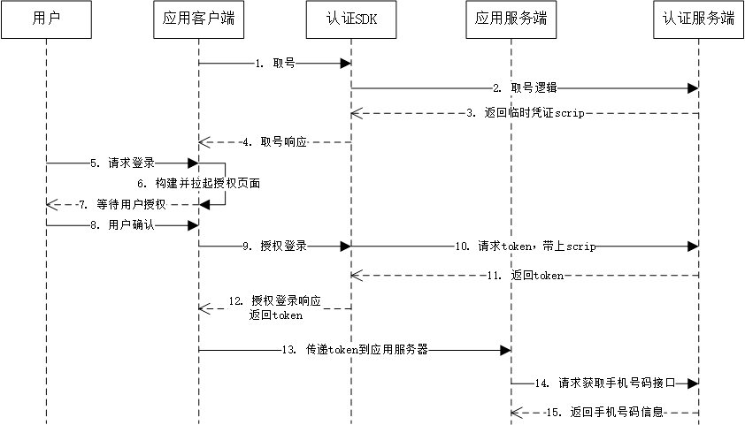
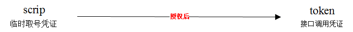
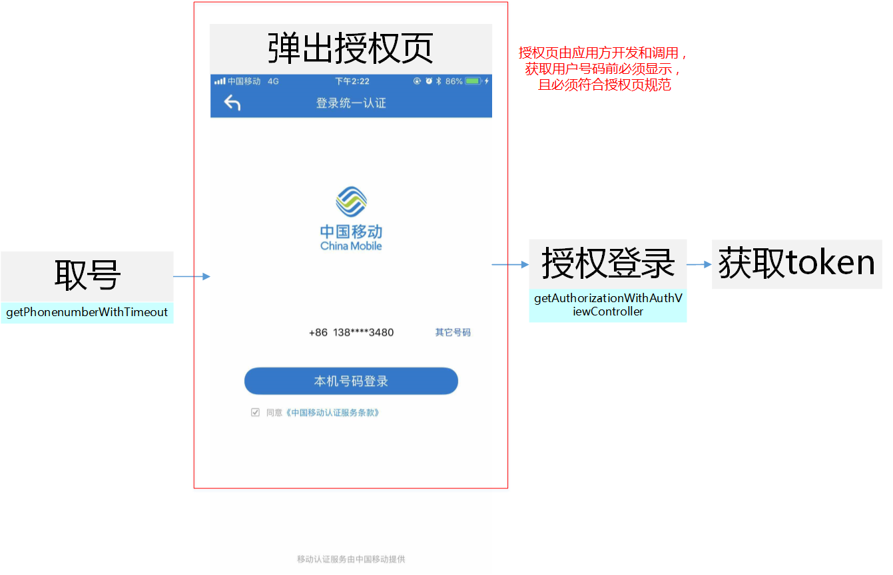
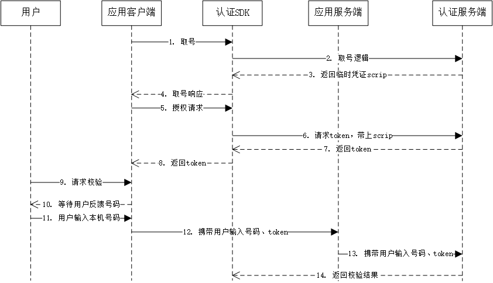

# 1. 接入指南
sdk技术问题沟通QQ群：609994083</br>

**注意事项：**

1. 目前SDK支持中国移动2/3/4G、中国电信4G的取号能力，中国联通的取号能力暂未开放。
2. 由于运营商取号能力是通过数据网关实现，取号过程必须在数据流量打开的情况下才能进行（WiFi和数据流量同时打开时，SDK会强制切换到数据流量执行取号逻辑，将会消耗用户少量流量），当信号弱或者网络有干扰时，时延会高于平均值，取号成功率较低。
3. 本SDK同时提供一键登录和本机号码校验功能，开发者根据实际的需求调用对应方法和接口。

## 1.1. 接入流程

**1.申请appid和appkey**

根据《开发者接入流程文档》，前往中国移动开发者社区（dev.10086.cn)，按照文档要求创建开发者账号并申请appid和appkey，并填写应用的包名.（bundle ID)

**2.申请能力**

应用创建完成后，在能力配置页面上，勾选应用需要接入的能力类型，如一键登录，并配置应用的服务器出口IP地址。（如果在服务端需要用非对称加密方法对一些重要信息进行加密处理，请在能力配置页面填写RSA加密的公钥）

**3.添加appid白名单**

开发者在完成步骤1和步骤2后，将appid提供给移动认证工作人员，移动方将在2个工作日内将appid加入白名单，白名单添加完毕，开发者就可以开始联调对接。

**4.上线审核**

应用上线前，开发者需要将一键登录取号能力的场景所使用的授权页面（授权页面参考授权页面规范）提供给移动认证产品接口人，审核无误后可正式上线。

## 1.2. 开发流程

**第一步：下载SDK及相关文档**

请在开发者群或官网下载最新的SDK包

**第二步：搭建开发环境**

1. xcode版本需使用9.0以上，否则会报错
2. 导入认证SDK的framework，直接将移动认证`TYRZSDK.framework`拖到项目中
3. 在Xcode中找到`TARGETS-->Build Setting-->Linking-->Other Linker Flags`在这选项中需要添加`-ObjC`


**第三步：开始使用移动认证SDK**

**[1] 初始化SDK**

在appDelegate.m文件的`didFinish`函数中添加初始化代码。初始化代码只需要执行一次就可以。

```objective-c
- (BOOL)application:(UIApplication *)application didFinishLaunchingWithOptions:(NSDictionary *)launchOptions {

     [TYRZSDK registerAppId:APPID appKey:APPKEY];
    return YES;
}
```

**方法原型：**

```objective-c
+ (void)registerAppId:(NSString *)appId appKey:(NSString *)appKey;
```

**参数说明：**

| 参数   | 类型     | 说明        |
| ------ | -------- | ----------- |
| appID  | NSString | 应用的appid |
| appKey | NSString | 应用密钥    |

<div STYLE="page-break-after: always;"></div>

# 2. 一键登录功能

## 2.1. 准备工作

在接入一键登录功能之前，开发者必须先按照1.1接入流程，在中国移动开发者社区注册开发者账号，创建一个包含移动认证能力的应用，获取响应的AppId和AppKey，并且在开发者社区中勾选一键登录能力，配置应用服务器出口ip地址。

##2.2. 流程说明 

移动认证一键登录允许开发者在用户同意授权后，在客户端侧获取`接口调用凭证`（token），第三方服务器携带token调用`获取手机号码接口`，实现获取当前授权登录用户的手机号码等信息。

整体流程为：

1. 开发者调用取号方法，取号成功后，SDK将缓存取号临时凭证scrip。
2. 开发者继承UAAuthViewController父类并创建授权页面控制器子类。
3. 用户同意应用获取本机号码，调用授权登录方法，获取接口调用凭证token。
4. 携带token进行接口调用，获取用户的手机号码信息。

一键登录整体流程：



##2.3. 获取临时取号凭证

开发者在需要使用一键登录的场景，调用SDK取号方法`getPhoneNumberWithTimeout`，认证服务端取号成功后，会返回一个临时取号凭证scrip缓存在内存，该scrip用于换取接口调用凭证token。scrip有效期默认为60分钟，开发者可以使用deleteScrip方法提前删除凭证。另外，为避免在网络环境较差的情况下下取号等待时间过长，开发者还可以对取号设置超时。



为了保证SDK取号成功率，开发者在取号前必须保证：

1. 运营商目前只支持中国移动2/3/4G和中国电信4G，开发者在调用取号方法前，可以预先判断当前用户的运营商类型和网络制式，仅针对SDK目前支持的运营商和网络制式使用一键登录功能。
2. 受运营商取号原理的限制，网关取号必须在数据流量打开的情况下进行，因此，用户如果关闭数据流量，将无法成功取号。
3. 任何改变运营商分配给手机的IP地址的行为（如VPN代理，路由器VPN、手机VPN），都无法取号。

**请求示例代码**

```objective-c
[TYRZSDK getPhoneNumberWithTimeout: 8000 
 						completion: ^ (NSDictionary * _Nonnull sender) {
        if ([sender[@ "resultCode"] isEqualToString: @"103000"]) {
            NSLog(@ "取号成功:%@", sender);
        } else {
            NSLog(@ "取号失败:%@", sender);
        }
    }];
```

**取号方法原型：**

```objective-c
+ (void)getPhoneNumberWithTimeout:(NSTimeInterval)duration 
    				   completion:(void (^)(NSDictionary * sender))completion;
```

**参数说明：**

| 参数       | 类型           | 说明                                       |
| ---------- | -------------- | ------------------------------------------ |
| duration   | NSTimeInterval | 自定义取号超时时间（默认8000毫秒），单位： |
| completion | Block          | 取号回调                                   |

**返回说明：**

| 参数          | 类型     | 说明                          |
| ------------- | -------- | ----------------------------- |
| resultCode    | NSString | 返回相应的结果码              |
| desc          | NSString | 调用描述                      |
| securityphone | NSString | 手机号码掩码，如“138XXXX0000” |

## 2.4. 创建授权页

为了确保用户在登录过程中将手机号码信息授权给开发者使用的知情权，一键登录需要开发者提供授权页登录页面供用户授权确认。开发者在调用授权登录方法前，必须弹出授权页，明确告知用户当前操作会将用户的本机号码信息传递给应用。授权页面的设计、布局、生成、弹出和消失，由开发者自行处理，但必须遵守移动认证授权页面设计规范。

### 2.4.1. 调用逻辑



### 2.4.2. 页面规范细则

1、页面必须包含登录/注册按钮，授权登录方法`loginAuth`必须绑定该按钮使用。

2、登录按钮文字描述必须包含“登录”或“注册”等文字，不得诱导用户授权。

3、页面需要提示应用获取到的是用户的本机号码，例如，可以在页面显示本机号码的掩码（securityphone），或者提示用户将使用“本机号码”作为账号登录或注册。

4、页面必须包含移动认证协议条款，其中：

​	条款名称：《中国移动认证服务条款》

​	条款页面地址：http://wap.cmpassport.com/resources/html/contract.html

5、应用在上线前需将满足上述1~4的授权页面（正式上线版的）截图提供给产品接口人审核。

6、应用后续升级时，如果授权页面有较大改动（针对1~4内容进行修改），需将改动的授权页面截图提供给产品接口人审核。

7、对于未遵照1~4设计要求，或通过技术手段故意屏蔽不弹出授权页面但获得调用接口凭证token的行为，移动有权将APP所有一键登录相关的能力下架，待整改后再重新上架服务。

### 2.4.3. 构建授权页控制器

授权登录页面由开发者设计和构建，在构建前，需继承SDK自有的控制器UAAuthViewController。

1.开发者继承SDK提供的模板父类UAAuthViewController创建自定义子类CustomAuthViewController，并在该子类中布局UI控件

```objective-c
// CustomAuthViewController.h
@interface CustomAuthViewController : UAAuthViewController

@end

// CustomAuthViewController.m
@implementation CustomAuthViewController

-(void)setupUI{
    
}

@end
```

2.客户端在需要拉起授权页的场景初始化授权页控制器动作

```objective-c
//初始化CustomAuthViewController类（即登录授权页）实例控制器，弹出这个授权页面。
CustomAuthViewController *authVC = [[CustomAuthViewController alloc]init];
[self presentViewController:authVC animated:YES completion:nil];
```

## 2.5. 授权并获取接口凭证

开发者完成2.3和2.4的逻辑后，确保临时取号凭证scrip有效，并且用户点击同意授权登录后，开发者可以调用授权方法，获取接口凭证token。为了保证scrip的有效性，建议开发者在调用授权登录方法前，再次调用取号方法。（如果scrip有效，再次调用取号方法的耗时非常少）

在调用授权方法时，必须将2.4中开发者创建的授权页控制器传入到本方法中，且需要保证页面正在内存运行中，否则取号失败。

**请求示例代码：**

```java
//1.构建授权页控制器

//2.调用取号方法（根据实际需求，也可以放在构建授权页控制前调用）
-(void)getPhonenumber{
    __weak typeof(self) weakSelf = self;
    [TYRZSDK getPhoneumberWithTimeout:8000 completion:^(NSDictionary * _Nonnull sender){
        if ([sender[@"resultCode"] isEqualToString:@"103000"]) {
            NSLog(@"取号成功:%@",sender);
            // 显示手机号码掩码
            weakSelf.securityPhoneLable.text = sender[@"securityphone"];
        } else {
            NSLog(@"取号失败:%@",sender);
            [weakSelf dismissViewControllerAnimated:YES completion:nil];
        }
    }];
}

//3.授权登录按钮点击事件，调用授权方法
-(void)authorizeLoginButtonClick{
    __weak typeof(self) weakSelf = self;
    [TYRZSDK getAuthorizationWithAuthViewController:weakSelf.authVC completion:^(NSDictionary * _Nonnull sender) {
        if ([sender[@"resultCode"] isEqualToString:@"103000"]) {
            NSLog(@"授权登录成功:%@",sender);
        } else {
            NSLog(@"授权登录失败:%@",sender);
        }
        [weakSelf dismissViewControllerAnimated:YES completion:nil];
    }];
}

//@end
```

**授权方法原型：**

```java
+ (void)getAuthorizationWithAuthViewController:(UAAuthViewController *_Nullable)authVC completion:(void (^)(NSDictionary *sender))completion;
```

**参数说明：**

**请求参数**

| 参数     | 类型                 | 说明                                                         |
| -------- | -------------------- | ------------------------------------------------------------ |
| authVC   | UAAuthViewController | 开发者构建的授权页控制器。当authVC传值为nil时，获取的token用于本机号码校验 |
| complete | Block                | 登录回调                                                     |

**响应参数**

| 参数       | 类型     | 说明                                                         |
| ---------- | -------- | ------------------------------------------------------------ |
| resultCode | NSString | 返回相应的结果码                                             |
| token      | NSString | 成功时返回：临时凭证，token有效期2min，一次有效，同一用户（手机号）10分钟内获取token且未使用的数量不超过30个 |
| openId     | NSString | 成功时返回：用户身份唯一标识 ,**隐式登录不返回openId字段**   |
| desc       | NSString | 返回描述                                                     |


##2.6. 获取手机号码（服务端）

开发者获取token后，需要将token传递到应用服务器，由应用服务器发起获取用户手机号接口的调用。

调用本接口，必须保证：

1. token在有效期内。（2分钟）
2. token还未使用过。
3. 应用服务器出口IP地址在开发者社区中配置正确。
4. 如果使用RSA加密，确保应用的公钥在开发者社区正确填写。

**接口说明：**

请求地址：https://www.cmpassport.com/unisdk/rsapi/loginTokenValidate

协议： HTTPS 

请求方法： POST+json,Content-type设置为application/json

**请求示例代码：**

```
{
    appid = 10000001;
    msgid = 34a5588136d6404784831609cdcdc633;
    sign = 2240b9213b9b8dccfe7f6257a21071cf;
    strictcheck = 0;
    systemtime = 20180529112443243;
    token = STsid00000015275642798949tUyg6KsmyEWKk005bCfuxUmCXeqeFRK;
    version = "2.0";
}

```

**参数说明**

| 参数                | 约束 | 说明                                                         |
| :------------------ | :--: | :----------------------------------------------------------- |
| version             | 必选 | 填2.0                                                        |
| msgid               | 必选 | 标识请求的随机数即可(1-36位)                                 |
| systemtime          | 必选 | 请求消息发送的系统时间，精确到毫秒，共17位，格式：20121227180001165 |
| strictcheck         | 必选 | 暂时填写"0"                                                  |
| appid               | 必选 | 业务在统一认证申请的应用id                                   |
| expandparams        | 可选 | 扩展参数                                                     |
| token               | 必选 | 需要解析的凭证值。                                           |
| sign                | 必选 | 当**encryptionalgorithm≠"RSA"**时，sign = MD5（appid + version + msgid + systemtime + strictcheck + token + appkey)（注：“+”号为合并意思，不包含在被加密的字符串中），输出32位大写字母；</br>当**encryptionalgorithm="RSA"**，业务端RSA私钥签名（appid+token）, 服务端使用业务端提供的公钥验证签名（公钥可以在开发者社区配置）。 |
| encryptionalgorithm | 可选 | 推荐使用。开发者如果需要使用非对称加密算法时，填写“RSA”。（当该值不设置为“RSA”时，执行MD5签名校验） |

**返回说明**

| 参数         | 类型   | 说明                                                         |
| ------------ | ------ | ------------------------------------------------------------ |
| inresponseto | string | 对应的请求消息中的msgid                                      |
| systemtime   | string | 响应消息发送的系统时间，精确到毫秒，共17位，格式：20121227180001165 |
| resultcode   | string | 返回码                                                       |
| msisdn       | string | 表示手机号码，如果加密方式为RSA，应用需要用私钥进行解密      |

<div STYLE="page-break-after: always;"></div>

# 3. 本机号码校验功能

## 3.1. 准备工作

在接入本机号码校验功能之前，开发者必须先按照1.1 接入流程，在中国移动开发者社区注册开发者账号，创建一个包含移动认证能力的应用，获取响应的AppId和AppKey。并且在开发者社区中勾选本机号码校验能力，配置应用服务器出口ip地址。

## 3.2. 流程说明

移动认证本机号码校验用于校验用户当前输入的手机号码是否为本机号码。

整体流程为：

1. 开发者调用取号方法，取号成功后，SDK将缓存取号临时凭证scrip；
2. 调用授权登录方法，获取接口凭证token；
3. 开发者使用本机号码校验的交互页面；
4. 携带token和手机号码信息进行接口调用，获取手机号码校验结果。

本机号码校验整体流程：



## 3.3. 获取临时取号凭证

开发者在需要使用一键登录的场景，调用SDK取号方法`getPhoneNumberWithTimeout`，认证服务端取号成功后，会返回一个临时取号凭证scrip缓存在内存，该scrip用于换取接口调用凭证token。scrip有效期默认为60分钟，开发者可以使用deleteScrip方法提前删除凭证。另外，为避免在网络环境较差的情况下下取号等待时间过长，开发者还可以对取号设置超时。


为了保证SDK取号成功率，开发者在取号前必须保证：

1. 运营商目前只支持中国移动2/3/4G和中国电信4G，开发者在调用取号方法前，可以预先判断当前用户的运营商类型和网络制式，仅针对SDK目前支持的运营商和网络制式使用一键登录功能。
2. 受运营商取号原理的限制，网关取号必须在数据流量打开的情况下进行，因此，用户如果关闭数据流量，将无法成功取号。
3. 任何改变运营商分配给手机的IP地址的行为（如VPN代理，路由器VPN、手机VPN），都无法取号。

**请求示例代码**

```objective-c
[TYRZSDK getPhoneNumberWithTimeout: 8000 
 						completion: ^ (NSDictionary * _Nonnull sender) {
        if ([sender[@ "resultCode"] isEqualToString: @"103000"]) {
            NSLog(@ "取号成功:%@", sender);
        } else {
            NSLog(@ "取号失败:%@", sender);
        }
    }];
```

**取号方法原型：**

```objective-c
+ (void)getPhoneNumberWithTimeout:(NSTimeInterval)duration 
    				   completion:(void (^)(NSDictionary * sender))completion;
```

**参数说明：**

| 参数       | 类型           | 说明                                       |
| ---------- | -------------- | ------------------------------------------ |
| duration   | NSTimeInterval | 自定义取号超时时间（默认8000毫秒），单位： |
| completion | Block          | 取号回调                                   |

**返回说明：**

| 参数          | 类型     | 说明                          |
| ------------- | -------- | ----------------------------- |
| resultCode    | NSString | 返回相应的结果码              |
| desc          | NSString | 调用描述                      |
| securityphone | NSString | 手机号码掩码，如“138XXXX0000” |

## 3.4. 授权并获取接口凭证

开发者完成2.3和2.4的逻辑后，确保临时取号凭证scrip有效，并且用户点击同意授权登录后，开发者可以调用授权方法，获取接口凭证token。为了保证scrip的有效性，建议开发者在调用授权登录方法前，再次调用取号方法。（如果scrip有效，再次调用取号方法的耗时非常少）

在调用授权登录方法时，将authVC对象传入值设为nil即可。

**请求示例代码：**

```java
-(void)loginImplicity{
// 1.调用取号方法
    [TYRZSDK getPhonenumberWithTimeout:8000 completion:^(NSDictionary * _Nonnull sender){
        if ([sender[@"resultCode"] isEqualToString:@"103000"]) {
            NSLog(@"取号成功:%@",sender);
            
// 2.调用授权方法
            [TYRZSDK getAuthorizationWithAuthViewController:nil completion:^(NSDictionary * _Nonnull sender) {
                if ([sender[@"resultCode"] isEqualToString:@"103000"]) {
                    NSLog(@"隐式登录成功:%@",sender);
                }else{
                    NSLog(@"隐式登录失败:%@",sender);
                }
            }];
        } else {
            NSLog(@"取号失败:%@",sender);
        }
    }];
}
```

**授权方法原型：**

```java
+ (void)getAuthorizationWithAuthViewController:(UAAuthViewController *_Nullable)authVC completion:(void (^)(NSDictionary *sender))completion;
```

**参数说明：**

**请求参数**

| 参数     | 类型                 | 说明                                                         |
| -------- | -------------------- | ------------------------------------------------------------ |
| authVC   | UAAuthViewController | 开发者构建的授权页控制器。当authVC传值为nil时，获取的token用于本机号码校验 |
| complete | Block                | 登录回调                                                     |

**响应参数**

| 参数       | 类型     | 说明                                                         |
| ---------- | -------- | ------------------------------------------------------------ |
| resultCode | NSString | 返回相应的结果码                                             |
| token      | NSString | 成功时返回：临时凭证，token有效期2min，一次有效，同一用户（手机号）10分钟内获取token且未使用的数量不超过30个 |
| openId     | NSString | 成功时返回：用户身份唯一标识 ,**隐式登录不返回openId字段**   |
| desc       | NSString | 返回描述                                                     |


## 3.5. 客户端交互页面设计

开发者在本机号码校验的使用场景（页面），引导提示用户输入本机号码，将手机号码和3.4中获取的接口凭证token传回应用服务器。

## 3.6. 本机号码校验（服务端）

开发者获取token后，需要将token传递到应用服务器，由应用服务器发起本机号码校验接口的调用。

调用本接口，必须保证：

1. token在有效期内（2分钟）。
2. token还未使用过。
3. 应用服务器出口IP地址在开发者社区中配置正确。

对于本机号码校验，需要注意：

1. 本产品属于收费业务，开发者未签订服务合同前，每天总调用次数有限，详情可咨询商务。
2. 签订合同后，将不在提供每天免费的测试次数。

**接口说明：**

请求地址： https://www.cmpassport.com/openapi/rs/tokenValidate

协议： HTTPS

请求方法： POST+json,Content-type设置为application/json

**请求示例代码：**

```
{
    body =     {
        openType = 1;
        phoneNum =0A2050AC434A32DE684745C829B3DE570590683FAA1C9374016EF60390E6CE76;
        requesterType = 0;
        sign = 87FCAC97BCF4B0B0D741FE1A85E4DF9603FD301CB3D7100BFB5763CCF61A1488;
        token = STsid0000001517194515125yghlPllAetv4YXx0v6vW2grV1v0votvD;
    };
    header =     {
        appId = 3000******76;
        msgId = f11585580266414fbde9f755451fb7a7;
        timestamp = 20180129105523519;
        version = "1.0";
    };
}
```

**参数说明：**

| 参数          | 层级  | 约束                         | 说明                                                         |
| ------------- | ----- | ---------------------------- | ------------------------------------------------------------ |
| **header**    | **1** | 必选                         |                                                              |
| version       | 2     | 必选                         | 版本号,初始版本号1.0,有升级后续调整                          |
| msgId         | 2     | 必选                         | 使用UUID标识请求的唯一性                                     |
| timestamp     | 2     | 必选                         | 请求消息发送的系统时间，精确到毫秒，共17位，格式：20121227180001165 |
| appId         | 2     | 必选                         | 应用ID                                                       |
| **body**      | **1** | 必选                         |                                                              |
| openType      | 2     | 否，requestertype字段为0时是 | 运营商类型：</br>1:移动;</br>2:联通;</br>3:电信;</br>0:未知  |
| requesterType | 2     | 是                           | 请求方类型：</br>0:APP；</br>1:WAP                           |
| message       | 2     | 否                           | 接入方预留参数，该参数会透传给通知接口，此参数需urlencode编码 |
| expandParams  | 2     | 否                           | 扩展参数格式：param1=value1\|param2=value2  方式传递，参数以竖线 \| 间隔方式传递，此参数需urlencode编码。 |
| phoneNum      | 2     | 是                           | 待校验的手机号码的64位sha256值，字母大写。（手机号码 + appKey + timestamp， “+”号为合并意思）（注：建议开发者对用户输入的手机号码的格式进行校验，增加校验通过的概率） |
| token         | 2     | 是                           | 身份标识，字符串形式的token                                  |
| sign          | 2     | 是                           | 签名，HMACSHA256( appId +     msgId + phonNum + timestamp + token + version)，输出64位大写字母 （注：“+”号为合并意思，不包含在被加密的字符串中,appkey为秘钥, 参数名做自然排序（Java是用TreeMap进行的自然排序）） |

**返回说明：**

| 参数         | 层级  | 类型   | 说明                                                         |
| ------------ | ----- | :----- | :----------------------------------------------------------- |
| **header**   | **1** |        |                                                              |
| msgId        | 2     | string | 对应的请求消息中的msgid                                      |
| timestamp    | 2     | string | 响应消息发送的系统时间，精确到毫秒，共17位，格式：20121227180001165 |
| appId        | 2     | string | 应用ID                                                       |
| resultCode   | 2     | string | 平台返回码                                                   |
| **body**     | **1** |        |                                                              |
| resultDesc   | 2     | String | 平台返回码                                                   |
| message      | 2     | String | 接入方预留参数，该参数会透传给通知接口，此参数需urlencode编码 |
| expandParams | 2     | String | 扩展参数格式：param1=value1\|param2=value2  方式传递，参数以竖线 \| 间隔方式传递，此参数需urlencode编码。 |

<div STYLE="page-break-after: always;"></div>

# 4. SDK方法说明

## 4.1. 初始化

### 4.1.1. 方法描述

**功能**

用于初始化appId、appKey设置。

**原型**

```objective-c
+ (void)registerAppId:(NSString *)appId appKey:(NSString *)appKey;
```

</br>

### 4.1.2. 参数说明

**请求参数**

| 参数   | 类型     | 说明        |
| ------ | -------- | ----------- |
| appID  | NSString | 应用的appid |
| appKey | NSString | 应用密钥    |

**响应参数**

无

## 4.2. 取号

### 4.2.1. 方法描述

**功能**

本方法用于发起取号请求，并缓存本次取号凭证scrip在内存中，有效期60分钟，应用内存被清空时，scrip也会一并失效。SDK将在后台完成网络判断、数据网络切换等内部操作并向网关请求申请获取用户本机号码。取号请求成功后，开发者就可以调用并弹出由开发者自定义布局的授权页面。另外，开发者可以调用删除凭证方法`deleteScrip`提前让凭证失效。

**注：**在调用授权登录方法`getAuthorization`时，必须要保证scrip有效，否则会取号失败

**原型**

```objective-c
+ (void)getPhoneNumberWithTimeout:
	(NSTimeInterval)duration completion:
		(void (^)(NSDictionary * sender))completion;
```

### 4.2.2. 参数说明

**请求参数**

| 参数       | 类型           | 说明                                       |
| ---------- | -------------- | ------------------------------------------ |
| duration   | NSTimeInterval | 自定义取号超时时间（默认8000毫秒），单位： |
| completion | Block          | 取号回调                                   |

**响应参数**

| 参数          | 类型     | 说明                          |
| ------------- | -------- | ----------------------------- |
| resultCode    | NSString | 返回相应的结果码              |
| desc          | NSString | 调用描述                      |
| securityphone | NSString | 手机号码掩码，如“138XXXX0000” |

### 4.2.3. 示例

**请求示例代码**

```objective-c
 [TYRZSDK getPhoneNumberWithTimeout: 8000 completion: ^ (NSDictionary * _Nonnull sender) {
        if ([sender[@ "resultCode"] isEqualToString: @"103000"]) {
            NSLog(@ "取号成功:%@", sender);
        } else {
            NSLog(@ "取号失败:%@", sender);
        }
    }];
```

**响应示例代码**

```
{
    "resultCode" = "103000";
    "desc" = "success";
    "securityphone" = "138XXXX0000"
}
```

## 4.3. 授权登录

### 4.3.1. 方法描述

**功能**

在应用弹出授权页的情况下，调用本方法可以成功获取取号凭证token。如果开发者需要**获取用户完整的手机号码**，调用该方法时，需要将正在运行的授权控制器传入并获取相对应的token；如果开发者需要做**本机号码校验**，调用该方法时，authVC参数传nil即可。

**注：**在调用授权登录方法前，必须先调用取号方法且保证scrip有效，否则会取号失败！建议开发者在调用本方法前，再一次调用取号方法`getPhoneNumber`，确保scrip有效（如果scrip还在有效期内，再次调用`getPhoneNumber`方法耗时非常小，大概10-30ms）

**原型**

```objective-c
+ (void)getAuthorizationWithAuthViewController:
	(UAAuthViewController *_Nullable)authVC completion:
		(void (^)(NSDictionary *sender))completion;
```

### 4.3.2. 参数说明

**请求参数**

| 参数     | 类型                 | 说明                                                         |
| -------- | -------------------- | ------------------------------------------------------------ |
| authVC   | UAAuthViewController | 开发者构建的授权页控制器。**当authVC传值为nil时，将不弹出授权页，登录方式为隐式登录** |
| complete | Block                | 登录回调                                                     |

**响应参数**

| 参数       | 类型     | 说明                                                         | 是否必填   |
| ---------- | -------- | ------------------------------------------------------------ | ---------- |
| resultCode | NSString | 返回相应的结果码                                             | 是         |
| token      | NSString | 成功时返回：临时凭证，token有效期2min，一次有效，同一用户（手机号）10分钟内获取token且未使用的数量不超过30个 | 成功时必填 |
| openId     | NSString | 成功时返回：用户身份唯一标识 ,**隐式登录不返回openId字段**   | 成功时必填 |
| desc       | NSString | 调用描述                                                     | 否         |

### 4.3.3. 示例

**完整一键登录调用示例**

```objective-c
//1.构建授权页控制器

//2.调用取号方法（根据实际需求，也可以放在构建授权页控制前调用）
-(void)getPhonenumber{
    __weak typeof(self) weakSelf = self;
    [TYRZSDK getPhoneumberWithTimeout:8000 completion:^(NSDictionary * _Nonnull sender){
        if ([sender[@"resultCode"] isEqualToString:@"103000"]) {
            NSLog(@"取号成功:%@",sender);
            // 显示手机号码掩码
            weakSelf.securityPhoneLable.text = sender[@"securityphone"];
        } else {
            NSLog(@"取号失败:%@",sender);
            [weakSelf dismissViewControllerAnimated:YES completion:nil];
        }
    }];
}

//3.授权登录按钮点击事件，调用授权方法
-(void)authorizeLoginButtonClick{
    __weak typeof(self) weakSelf = self;
    [TYRZSDK getAuthorizationWithAuthViewController:weakSelf.authVC completion:^(NSDictionary * _Nonnull sender) {
        if ([sender[@"resultCode"] isEqualToString:@"103000"]) {
            NSLog(@"授权登录成功:%@",sender);
        } else {
            NSLog(@"授权登录失败:%@",sender);
        }
        [weakSelf dismissViewControllerAnimated:YES completion:nil];
    }];
}

//@end
```

**响应示例代码**

```
{
    "openId" = "003JI1Jg1rmApSg6yG0ydUgLWZ4Bnx0rb4wtWLtyDRc0WAWoAUmE";
    "resultCode" = "103000";
    "desc" = ""
    "token" = "84840100013202003A4E45564452444D794E7A6C474E45557A4F4441314D304E4340687474703A2F2F3132302E3139372E3233352E32373A383038302F72732F403032030004030DF69E040012383030313230313730383137313031343230FF0020C8C9629B915C41DC3C9528E5D5796BB1551F2A49F8FCF7B5BA23ED0F28A8FAE9";
}
```

## 4.4. 获取网络状态和运营商类型

### 4.4.1. 方法描述

**功能：**

本方法用于获取用户当前的网络环境和运营商

**原型：**

```objective-c
+(NSDictionary*)getNetworkType;
```

### 4.4.2. 参数说明

**请求参数**

无

**响应参数**

| 参数        | 类型     | 说明                                                   |
| ----------- | -------- | ------------------------------------------------------ |
| networkType | NSNumber | 0.无网络;</br>1.数据流量;</br>2.wifi;</br>3.数据+wifi  |
| carrier     | NSNumber | 0.未知;</br>1.中国移动;</br>2.中国联通;</br>3.中国电信 |

## 4.5. 删除临时取号凭证

### 4.5.1. 方法描述

**功能**

本方法用于删除取号方法`getPhoneNumberWithTimeout`成功后返回的取号凭证scrip

**原型**

```objective-c
+(BOOL)delectScrip;
```

### 4.5.2. 参数说明

**请求参数**

无

**响应参数**

| 参数  | 类型 | 说明                                          |
| ----- | ---- | --------------------------------------------- |
| state | BOOL | 删除结果状态，（YES：删除成功，NO：删除失败） |

<div STYLE="page-break-after: always;"></div>

# 5. 服务端接口说明

## 5.1. 获取手机号码接口

业务平台或服务端携带用户授权成功后的token来调用认证服务端获取用户手机号码等信息。

### 5.1.1. 接口说明

**请求地址：**https://www.cmpassport.com/unisdk/rsapi/loginTokenValidate

**协议：** HTTPS 

**请求方法：** POST+json,Content-type设置为application/json

**注意：开发者需到开发者社区填写服务端出口IP地址后才能正常使用**

</br>

### 5.1.2. 参数说明

**请求参数**

| 参数                  |   类型   |  约束  | 说明                                       |
| :------------------ | :----: | :--: | :--------------------------------------- |
| version             | string |  必选  | 填2.0                                     |
| msgid               | string |  必选  | 标识请求的随机数即可(1-36位)                        |
| systemtime          | string |  必选  | 请求消息发送的系统时间，精确到毫秒，共17位，格式：20121227180001165 |
| strictcheck         | string |  必选  | 暂时填写"0"                                  |
| appid               | string |  必选  | 业务在统一认证申请的应用id                           |
| expandparams        | string |  可选  | 扩展参数                                     |
| token               | string |  必选  | 需要解析的凭证值。                                |
| sign                | string |  必选  | 当**encryptionalgorithm≠"RSA"**时，sign = MD5（appid + version + msgid + systemtime + strictcheck + token + appkey)（注：“+”号为合并意思，不包含在被加密的字符串中），输出32位大写字母；</br>当**encryptionalgorithm="RSA"**，业务端RSA私钥签名（appid+token）, 服务端使用业务端提供的公钥验证签名（公钥可以在开发者社区配置）。 |
| encryptionalgorithm | string |  可选  | 开发者如果需要使用非对称加密算法时，填写“RSA”。（当该值不设置为“RSA”时，执行MD5签名校验） |

</br>

**响应参数**

| 参数         | 类型   | 约束 | 说明                                                         |
| ------------ | ------ | ---- | ------------------------------------------------------------ |
| inresponseto | string | 必选 | 对应的请求消息中的msgid                                      |
| systemtime   | string | 必选 | 响应消息发送的系统时间，精确到毫秒，共17位，格式：20121227180001165 |
| resultcode   | string | 必选 | 返回码                                                       |
| msisdn       | string | 必选 | 表示手机号码，如果加密方式为RSA，应用需要用私钥进行解密      |

</br>

### 5.1.3. 示例

**请求示例**

```
{
    appid = 3000******76; 
    msgid = 335e06a28f064b999d6a25e403991e4c;
    sign = 213EF8D0CC71548945A83166575DFA68;
    strictcheck = 0;
    systemtime = 20180129112955435;
    token = STsid0000001517196594066OHmZvPMBwn2MkFxwvWkV12JixwuZuyDU;
    version = "2.0";
}
```

**响应示例**

```
{
    inresponseto = 335e06a28f064b999d6a25e403991e4c;
    msisdn = 14700000000;
    resultCode = 103000;
    systemtime = 20180129112955477;
}
```

<div STYLE="page-break-after: always;"></div>

## 5.2. 本机号码校验接口

校验用户输入的号码是否本机号码。
应用将手机号码传给移动认证SDK，移动认证SDK向认证服务端发起本机号码校验请求，认证服务端通过网关获取本机手机号码和第三方应用传输的手机号码进行校验，返回校验结果。

### 5.2.1. 接口说明

**调用次数说明：**本产品属于收费业务，开发者未签订服务合同前，每天总调用次数有限，详情可咨询商务。

**请求地址：** https://www.cmpassport.com/openapi/rs/tokenValidate

**协议：** HTTPS

**请求方法：** POST+json,Content-type设置为application/json

**回调地址：**请参考开发者接入流程文档

### 5.2.2.  参数说明

**请求参数**

| 参数            | 类型     | 层级    | 约束                    | 说明                                       |
| ------------- | ------ | ----- | --------------------- | ---------------------------------------- |
| **header**    |        | **1** | 必选                    |                                          |
| version       | string | 2     | 必选                    | 版本号,初始版本号1.0,有升级后续调整                     |
| msgId         | string | 2     | 必选                    | 使用UUID标识请求的唯一性                           |
| timestamp     | string | 2     | 必选                    | 请求消息发送的系统时间，精确到毫秒，共17位，格式：20121227180001165 |
| appId         | string | 2     | 必选                    | 应用ID                                     |
| **body**      |        | **1** | 必选                    |                                          |
| openType      | String | 2     | 否，requestertype字段为0时是 | 运营商类型：</br>1:移动;</br>2:联通;</br>3:电信;</br>0:未知 |
| requesterType | String | 2     | 是                     | 请求方类型：</br>0:APP；</br>1:WAP              |
| message       | String | 2     | 否                     | 接入方预留参数，该参数会透传给通知接口，此参数需urlencode编码      |
| expandParams  | String | 2     | 否                     | 扩展参数格式：param1=value1\|param2=value2  方式传递，参数以竖线 \| 间隔方式传递，此参数需urlencode编码。 |
| phoneNum      | String | 2     | 是                     | 待校验的手机号码的64位sha256值，字母大写。（手机号码 + appKey + timestamp， “+”号为合并意思）（注：建议开发者对用户输入的手机号码的格式进行校验，增加校验通过的概率） |
| token         | String | 2     | 是                     | 身份标识，字符串形式的token                         |
| sign          | String | 2     | 是                     | 签名，HMACSHA256( appId +     msgId + phonNum + timestamp + token + version)，输出64位大写字母 （注：“+”号为合并意思，不包含在被加密的字符串中,appkey为秘钥, 参数名做自然排序（Java是用TreeMap进行的自然排序）） |
|               |        |       |                       |                                          |

**响应参数**

| 参数         | 层级  | 类型   | 约束 | 说明                                                         |
| ------------ | ----- | :----- | :--- | :----------------------------------------------------------- |
| **header**   | **1** |        | 必选 |                                                              |
| msgId        | 2     | string | 必选 | 对应的请求消息中的msgid                                      |
| timestamp    | 2     | string | 必选 | 响应消息发送的系统时间，精确到毫秒，共17位，格式：20121227180001165 |
| appId        | 2     | string | 必选 | 应用ID                                                       |
| resultCode   | 2     | string | 必选 | 平台返回码                                                   |
| **body**     | **1** |        | 必选 |                                                              |
| resultDesc   | 2     | String | 必选 | 平台返回码                                                   |
| message      | 2     | String | 否   | 接入方预留参数，该参数会透传给通知接口，此参数需urlencode编码 |
| expandParams | 2     | String | 否   | 扩展参数格式：param1=value1\|param2=value2  方式传递，参数以竖线 \| 间隔方式传递，此参数需urlencode编码。 |

### 5.2.3. 示例

**请求示例**

```
{
    body =     {
        openType = 1;
        phoneNum =0A2050AC434A32DE684745C829B3DE570590683FAA1C9374016EF60390E6CE76;
        requesterType = 0;
        sign = 87FCAC97BCF4B0B0D741FE1A85E4DF9603FD301CB3D7100BFB5763CCF61A1488;
        token = STsid0000001517194515125yghlPllAetv4YXx0v6vW2grV1v0votvD;
    };
    header =     {
        appId = 3000******76;
        msgId = f11585580266414fbde9f755451fb7a7;
        timestamp = 20180129105523519;
        version = "1.0";
    };
}
```

**响应示例**

```
{
    body =     {
        message = "";
        resultDesc = "\U662f\U672c\U673a\U53f7\U7801";
    };
    header =     {
        appId = 3000******76;
        msgId = f11585580266414fbde9f755451fb7a7;
        resultCode = 000;
        timestamp = 20180129105523701;
    };
}
```

<div STYLE="page-break-after: always;"></div>

# 6. 返回码说明

##6.1. SDK返回码

使用SDK时，SDK会在认证结束后将结果回调给开发者，其中结果为JSONObject对象，其中resultCode为结果响应码，103000代表成功，其他为失败。成功时在根据token字段取出身份标识。失败时根据resultCode定位失败原因。

| 错误编号      | 返回码描述                                         |
| ------------- | -------------------------------------------------- |
| 103000        | 成功                                               |
| 200009        | Bundle ID与服务器填写的不一致                      |
| 200010        | 当前网络环境下不支持的认证方式                     |
| 200011        | 应用未允许HTTP请求                                 |
| 200020        | 用户取消授权                                       |
| 200021        | 数据解析异常                                       |
| 200022        | 无网络                                             |
| 200023        | 请求超时                                           |
| 200025        | 未知错误一般出现在线程捕获异常，请配合异常打印分析 |
| 200026        | 输入参数错误                                       |
| 200027        | 未开启数据网络                                     |
| 200028        | 网络请求出错                                       |
| 200029        | 请求返回的数据不完整                               |
| 200030        | 没有进行初始化APPId、APPKey参数                    |
| 200037        | 获取不到openid                                     |
| 200038        | 电信重定向失败                                     |
| 200039        | 电信取号接口返回失败                               |
| 200040        | UI资源加载异常                                     |
| 200041        | 应用未授权（未勾选能力）                           |
| 200042        | 授权页弹出异常                                     |
| 200047        | 网络异常                                           |
| 200048        | 用户未安装sim卡                                    |
| 200051~200059 | socket相关错误                                     |
| 200060~200068 | 电信取号相关错误                                   |
| 105302        | AppId不在白名单                                    |

</br>

## 6.2. 获取手机号码接口返回码

| 返回码 | 返回码描述                                                |
| ------ | --------------------------------------------------------- |
| 103000 | 返回成功                                                  |
| 103101 | 签名错误                                                  |
| 103102 | 包名/包签名/bundle ID错误                                 |
| 103106 | 输入手机号不合法（短验）                                  |
| 103107 | 已存在相同的随机数（短验）                                |
| 103108 | 短信验证码错误                                            |
| 103109 | 短信验证码超时                                            |
| 103111 | wap网关IP错误                                             |
| 103112 | 错误的请求                                                |
| 103113 | token校验错误                                             |
| 103119 | appid不合法                                               |
| 103122 | btid不存在                                                |
| 103125 | 手机号格式错误（短验）                                    |
| 103127 | 证书验证：版本过期                                        |
| 103133 | sourceid不合法                                            |
| 103138 | appid已存在                                               |
| 103139 | sourceid已存在                                            |
| 103202 | 缓存用户不存在或者验证短信输入失败次数过多                |
| 103203 | 缓存用户不存在（短信上行）                                |
| 103204 | 缓存随机数不存                                            |
| 103205 | 服务器异常                                                |
| 103207 | 发送短信失败                                              |
| 103211 | 其他错误                                                  |
| 103214 | 访问缓存或数据库错误                                      |
| 103401 | 消息签名为空                                              |
| 103404 | 加密失败                                                  |
| 103408 | 此sourceId注册已达上限99次                                |
| 103409 | query参数为空                                             |
| 103412 | 无效的请求                                                |
| 103414 | 参数效验异常                                              |
| 103505 | 重放攻击                                                  |
| 103511 | 源IP不合法                                                |
| 103810 | token校验失败，接口版本不一致                             |
| 103811 | token为空                                                 |
| 103901 | 短信验证码下发次数已达上限 (一分钟内最多5次,一天最多10次) |
| 103902 | 临时取号凭证scrip校验失败                                 |
| 103911 | 请求过于频繁（短信校验）                                  |
| 103922 | 自动升级文件没找到                                        |
| 104201 | token已经被校验过或者超时失效                             |
| 104202 | 短信验证失败过多                                          |
| 105001 | 联通网关取号失败                                          |
| 105002 | 移动网关取号失败                                          |
| 105003 | 电信网关取号失败                                          |
| 105005 | 短信上行发送信息为空                                      |
| 105007 | 手机号码格式错误（短信上行）                              |
| 105008 | 短信内容为空（短信上行）                                  |
| 105010 | script失效或者非法                                        |
| 105011 | 参数加密的私钥失效或者非法                                |
| 105012 | 不支持电信取号                                            |
| 105013 | 不支持联通取号                                            |
| 105018 | 用户权限不够                                              |
| 105019 | 应用未授权（未勾选能力）                                  |
| 105302 | AppId不在白名单                                           |

## 6.3. 本机号码校验接口返回码

本返回码表仅针对`本机号码校验接口`使用

| 返回码 | 说明                       |
| ------ | -------------------------- |
| 000    | 是本机号码（纳入计费次数） |
| 001    | 非本机号码（纳入计费次数） |
| 002    | 取号失败                   |
| 003    | 调用内部token校验接口失败  |
| 004    | 加密手机号码错误           |
| 102    | 参数无效                   |
| 124    | 白名单校验失败             |
| 302    | sign校验失败               |
| 303    | 参数解析错误               |
| 606    | 验证Token失败              |
| 999    | 系统异常                   |
| 102315 | 次数已用完                 |